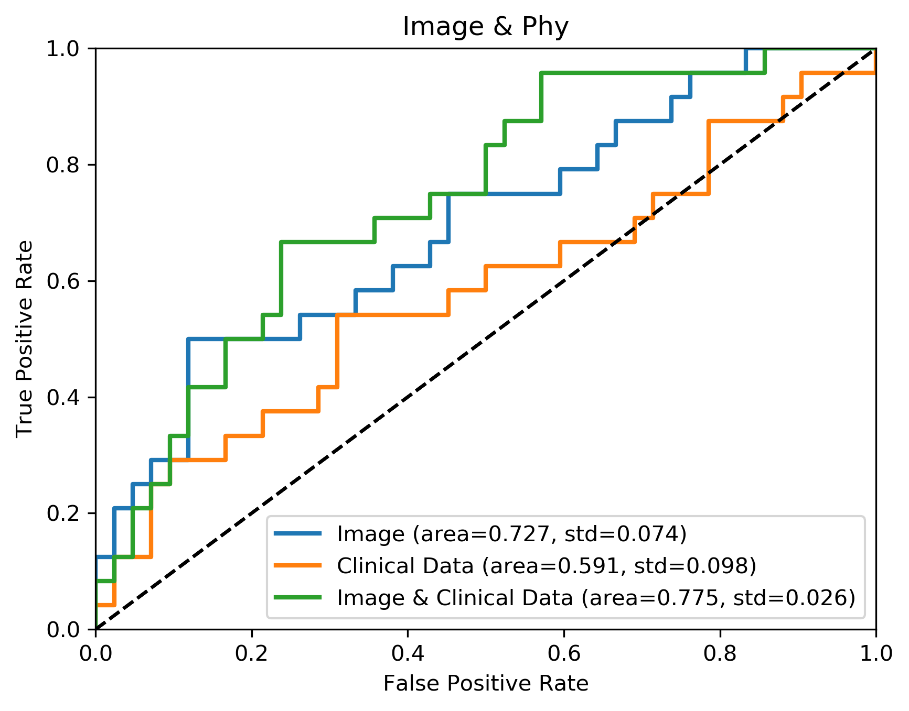

# Edema-Prediction

## Goal

Predict the outcome of celebral edema patients from MRI

## Process and Results

### 1. Whole Image

__**The codes and correspond explanations are in "[whole_img.ipynb](whole_img.ipynb)"**__

We used coronal T2-flair Digital Imaging and Communications in Medicine (DICOM) images, which are from 66 patients before and after their first therapy. All images are resized to 320 pixels in the row and 320 pixels in the column. The Spacings are adjusted by individual specific resizing ratio. For example, after resizing, a $640pixel*640pixel$ image with $0.359*0.359$ in Spacing will become a $640pixel*640pixel$ image with $0.718*0.718$ in Spacing.

The segmentation for all series of MRI images is completed by OpenCV via the combination of its bilateralFilter, threshold, getStructuringElement, morphologyEx and findContours algorithms. (The codes can be checked in Supplement Material. They're in relics folder now.)

After automatic segmentation, manual proofreading in every image is done to correct mistakes. Finally, every image in every series has its specific binary mask in a 0.PNG file. The 1 in file means the pixel is in the area of interest i.e. cerebral edema, while the 0 in file is not.

After segmentation, the images and their correspondent masks are plugged into PyRadiomics (version 1.3.0.post92+g974a734), a flexible open-source platform capable of extracting a large panel of engineered features from medical images, under its MR_5mm setting. 961 features are created, including features for Statistics, Shape, GLCM, GLRLM and GLSZM. The detail setting is *MR_5mm.yaml*.

The effect of the therapy is defined by whether the volume of cerebral edema reduce to less than 75% of its previous volume that is before one course of treatment. If cerebral edema’s volume declines to such extent, the therapy is effective; otherwise, the therapy doesn’t work well.

Study has shown that 8 types of features, "ASM", "Contrast", "Correlation", "Homogeneity", "Entropy", "Variance", "Skewness", "Kurtosis", which might demonstrate important characters of radiomic images (Aggarwal and Agrawal, 2012). Besides, empirically, shape features like “Surface Area”, “Surface Volume Ratio” and original “Volume” might relate to the effect of the therapy.

1. Results of Image Analysis

We seprate these samples into two groups by whether the therapy is effective. T-Test was conducted to show which features are significantly different between two groups. We selected features inside by condition that the feature belong to the 9 types above and is with p-value less than 0.1. If multiple features fit the condition but belong the same type, only the one with the least p-value is selected, since features in the same type are different in their filers and matrixes which only influence their emphasis but represent the same idiosyncrasy of images. Finally, 6 features, as following *Table 1*, were selected. These feature might inply whether the patient fit this threpy. Also, they could provide information about where should be studied in patients' brain to better understand the mechanism of the illness and the therapy.

Table 1

|         feature |   statistic |     pvalue |
|:--------------------------------|------------:|-----------:|
| wavelet-LHL_firstorder_Variance |    -2.74287 | 0.00789041 |
| wavelet-LHL_firstorder_Entropy  |    -2.37801 | 0.0204036  |
| wavelet-LHL_glcm_Contrast       |    -2.21694 | 0.030187   |
| wavelet-LHL_firstorder_Skewness |    -2.17202 | 0.033566   |
| wavelet-LHH_glcm_Correlation    |     1.99347 | 0.0504758  |
| original_firstorder_Kurtosis    |     1.87788 | 0.0649546  |

2. Results of Clinical Data Analysis

Besides, our clinical features including physiological information like 'Glu', 'Chol', 'Gly', 'HDL' etc., were filtered in the same way. Their relationship with the therapy outcome was analysed by t-test. In *Tabel 2*, While the clinal feature with the less p-value among them has a p-value that equals to 0.162, during our testing, adding two features, BUN and PK actually improves the performance of our Logistic Regression model. Thus, three clinical features, BUN with p-value that equals to 0.218 and PK p-value that equals to 0.233 were selected.

Table 2

|           |   statistic |   pvalue |
|:----------|------------:|---------:|
| LDL       |     1.41234 | 0.162695 |
| BUN       |    -1.24192 | 0.2188   |
| PK        |    -1.20383 | 0.233088 |
| Necktimes |    -1.1783  | 0.243039 |
| Neckdose  |    -1.1783  | 0.243039 |

Selected radiomic features with their associated feature group, filter and description are summarize in Table 2. Together these features provide characters of one cerebral edema, like its smoothness, pattern diversity and other texture-like traits.

3. Results of Model Performance

Finally, the area under the receiver operating characteristics curves (AUCs) for primary Logistic Regression model is 0.591，0.727 and 0.775 for using selected clinical features only, using selected radiomic features only and using both selected clinical features and selected radiomic features, respectively.

### 2. Bilateral Analysis

__**The codes and correspond explanations are in "[bilateral_img.ipynb](bilateral_img.ipynb)"**__

Among our 66 patient samples, 38 patients’cerebral edemas are bilateral. We selected 21 samples whose both unilateral cerebral edema volumes before therapy are larger than 2000$mm^3$ from them, since our method cannot handle the cerebral edema which is smaller than 2000$mm^3$ well. The unilateral radiomics images were created by slicing the primary images from the x-axis middle. The correspondent mask files were processed in the same way. Finally, 84 unilateral radiomics images and 84 mask files were created from before therapy and after therapy ($21*2*2=84$).

We used PyRadiomics with its exampleMR_5mm setting to analysis these “created” unilateral cerebral edema. The volume change that means effectiveness of therapy is set by the same condition, more than 25% of before therapy volume reduce. The outcomes of two unilateral cerebral edema images sliced from one bilateral cerebral edema image have three different relationships with that from their parental primary image: the outcomes are the same; the outcomes are different but the larger volume one has the same outcome as the whole’s and the outcomes are different but the smaller volume one has the same outcome as the whole’s.

1. The effectiveness based on the whole volume change is representative

Only 4.8% of 21 patients or say, one patient’s the smaller side rein the whole trend (Supplement Figure 1). This one with 50517.0 $mm^3$ cerebral edema in the right and 27729.0 $mm^3$ cerebral edema in the left became the one with 37125.0 $mm^3$ and 22221.0 $mm^3$ cerebral edema in right brain and left brain, respectively. As a result, the outcome of the right side that's larger volume, is effective (26.5%) and the outcome of the left side, the one with smaller volume, is not effective (19.8%), while the whole outcome is not effective (24.1%). Supplement Figure 2 shows this case.

Assuming the larger the unilateral cerebral edema is, the more important role it plays in symptom, because the whole outcome are almost all the same as the outcome of the larger one, whole outcome of the bilateral cerebral edema will be a good harbinger for the consequence of the therapy. Besides, 24.1% is quietly near to 25%. This outcome of whole would be defined as effective under a laxer condition and would be the same as its larger volume part’s, which means the outliner is not a categorical outliner at all. In conclusion, for bilateral cerebral edema, the effectiveness based on the whole volume change is representative.

Supplement Figure 1.

Supplement Figure 2.

2. The distance of two unilateral cerebral edema images from one patient is smaller than the distance of unilateral cerebral edema images in different patients.

First, we computed the distance in one patient (the distance between one patient's two parts) and the distance in different patients (the distance between one patient and the other patient) of each feature. Distances are judged by absolute difference. Figure 4 shows the result.

To compare the distance in one patient and that in different patients, we done the following analysis. 'wavelet-LHL_firstorder_Variance', 'wavelet-LHL_firstorder_Entropy', 'wavelet-LHL_glcm_Contrast', 'wavelet-LHL_firstorder_Skewness', 'wavelet-LHH_glcm_Correlation', 'original_firstorder_Kurtosis', which are selected previously, are utilised to represent the image features of sliced unilateral cerebral edema radiomics images. The values are standardised by standardization
$$
z = \frac{x - \mu}{\sigma}
$$
with mean:
$$
\mu = \frac{1}{N} \sum_{i=1}^N x_i
$$
and standard deviation:
$$
\sigma = \sqrt{\frac{1}{N} \sum_{i=1}^N (x_i - \mu)^2}
$$
 first. Then the weights of features are adjusted by the absolute value ratio of t-statistic, i.e. multiplying 1.2298782178898857, 1.0662763400478648, 0.9940534971423753, 0.9739126591525356, 0.8938536400797659, 0.8420256456875721, respectively.

Many studies use Euclidean distance to analyse the similarity of two staff, especially images (Eamoraphan, 2003; Li and Lu, 2009; Shabrina, 2011). Therefore, the distance of images is calculated by Minkowski Distance
$$
\left(\sum_{i=1}^n |x_i-y_i|^p\right)^{1/p}
$$
 on norm (p) = 2, i.e. Euclidean distance. The distance between one patient’s sliced cerebral edema and these from other patients are represented by the mean of all distances between it and each of other patients'. As Figure 5 demonstrates, the distance of two unilateral cerebral edema images from one patient are significantly smaller than the mean of distances between one and unilateral cerebral edema images from different patients. Two-tailed T-test outputs P-value= 0.0002.

Figure 4

Figure 5 The distance of two unilateral cerebral edema images from one patient is significantly smaller than the distance of unilateral cerebral edema images in different patients.

1. Wavelet-LHL_firstorder_Variance is worth studying

Finally, we compared the correlation between left features and right features in same outcome group and different outcome group by Pearson correlation.
$$
\rho = \frac{\text{cov}(X,Y)}{\sigma_x \sigma_y}
$$
$$
r = \frac{{}\sum_{i=1}^{n} (x_i - \overline{x})(y_i - \overline{y})}
{\sqrt{\sum_{i=1}^{n} (x_i - \overline{x})^2(y_i - \overline{y})^2}}
$$
For example, if the correlation of one feature is high in the former group, while it's low in the latter group, this feature may indicate some peculiarities of the difference, which is worth studying.

As Figure 6 and Table 3 show, the coefficient wavelet-LHL_firstorder_Variance in Same Outcome Group is 0.898986, while the one in in Different Outcome Group is 0.363959, which may imply this feature is related to whether both parts of the bilateral have the same outcome. The lower its Pearson correlation coefficient between two sides, the more likely the two sides have different outcomes.

However, as Figure 7 shows, this feature cannot provide sufficient information about whether the therapy is effective for one part. The value of this feature in effective and ineffective group gathered by side is not significantly different.

Figure 6

Table 3
|Features in Same Outcome Group|   Pearson correlation coefficient |     p-value |
|:--------------------------------|----------------------------------:|------------:|
| wavelet-LHL_firstorder_Variance |                         0.898986  | 2.92383e-05 |
| wavelet-LHL_firstorder_Entropy  |                         0.870631  | 0.000107746 |
| wavelet-LHL_glcm_Contrast       |                         0.841067  | 0.000314867 |
| wavelet-LHL_firstorder_Skewness |                         0.0700653 | 0.820076    |
| wavelet-LHH_glcm_Correlation    |                        -0.0343937 | 0.911185    |
| original_firstorder_Kurtosis    |                         0.0686227 | 0.823728    |

|Features in Different Outcome Group|   Pearson correlation coefficient |   p-value |
|:--------------------------------|----------------------------------:|----------:|
| wavelet-LHL_firstorder_Variance |                          0.363959 | 0.375447  |
| wavelet-LHL_firstorder_Entropy  |                          0.588723 | 0.124684  |
| wavelet-LHL_glcm_Contrast       |                          0.369895 | 0.367113  |
| wavelet-LHL_firstorder_Skewness |                         -0.144002 | 0.733706  |
| wavelet-LHH_glcm_Correlation    |                         -0.251074 | 0.548646  |
| original_firstorder_Kurtosis    |                          0.851649 | 0.0072811 |

Figure 7

### Reference

Aggarwal, N. and Agrawal, R.K. (2012) First and Second Order Statistics Features for Classification of Magnetic Resonance Brain Images, Journal of Signal & Information Processing, 3, 146-153.

Bi, W., et al. (2017) Radiographic Prediction of Meningioma Grade and Genomic Profile, Journal of Neurological Surgery Part B Skull Base, 78, S1-S156.

Coroller, T.P., et al. (2017) Radiomic-Based Pathological Response Prediction from Primary Tumors and Lymph Nodes in NSCLC, Journal of Thoracic Oncology Official Publication of the International Association for the Study of Lung Cancer, 12, 467.

Eamoraphan, C. (2003) Content-based image retrieval by spatial similarity using euclidean distance from centroid of common objects.

Li, J. and Lu, B.L. (2009) An adaptive image Euclidean distance. Elsevier Science Inc.

Shabrina, K. (2011) ANALYSIS USING DISTANCE MEASURING EUCLIDEAN DISTANCE SIMILARITY IMAGE AS THE BASIS OF IRIS EYE.

TODO